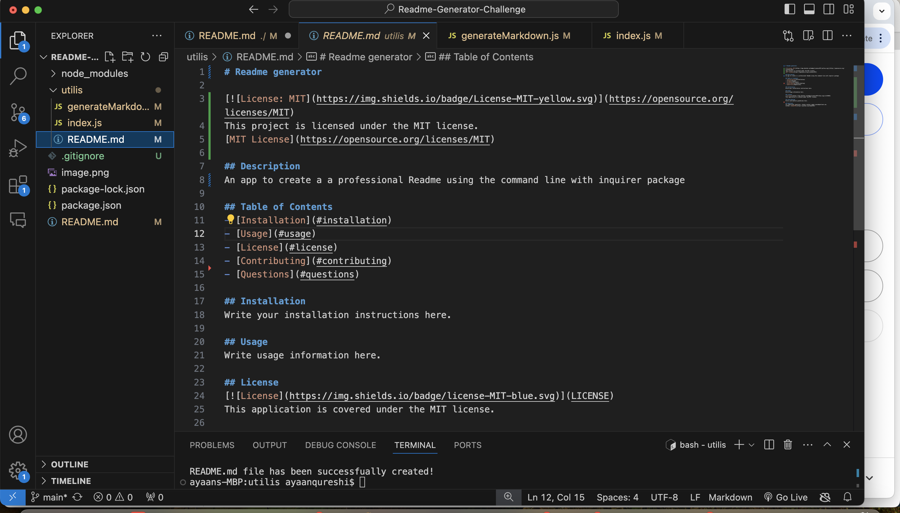
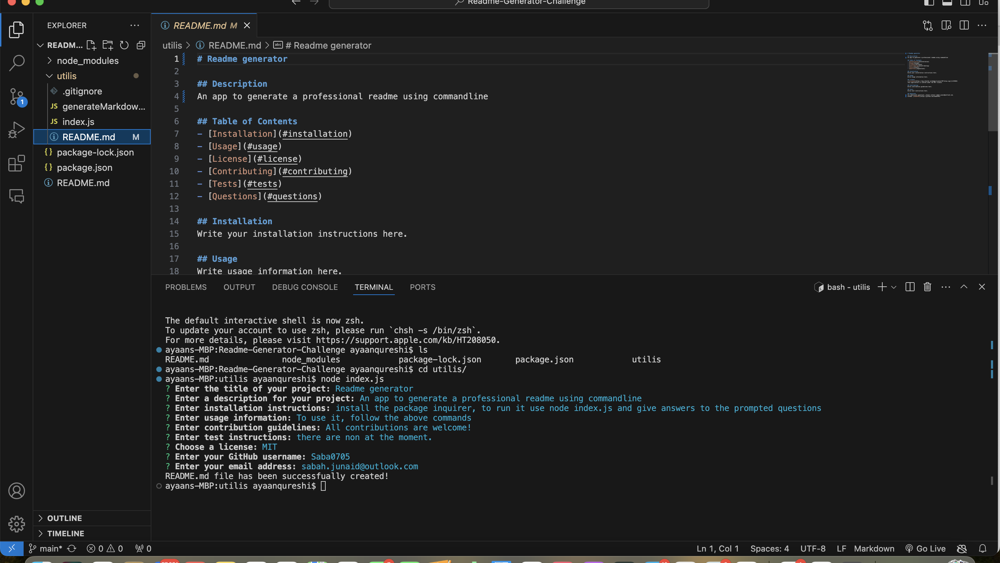

# Readme-Generator-Challenge

## Description: 
The challenge was to create a commanline app that allows you to generate a professional readme file from a user's input using the Inquirer Package.

## Table of Contents 

- [Description] (#description)
- [ChallengeElements] (#challenge elements)
- [Installation](#installation)
- [Usage](#usage)
- [Questions] (questions)

## Challenge Elements 

User story
AS A developer
I WANT a README generator
SO THAT I can quickly create a professional README for a new project

Acceptance Criteria
GIVEN a command-line application that accepts user input
WHEN I am prompted for information about my application repository
THEN a high-quality, professional README.md is generated with the title of my project and sections entitled Description, Table of Contents, Installation, Usage, License, Contributing, Tests, and Questions
WHEN I enter my project title
THEN this is displayed as the title of the README
WHEN I enter a description, installation instructions, usage information, contribution guidelines, and test instructions
THEN this information is added to the sections of the README entitled Description, Installation, Usage, Contributing, and Tests
WHEN I choose a license for my application from a list of options
THEN a badge for that license is added near the top of the README and a notice is added to the section of the README entitled License that explains which license the application is covered under
WHEN I enter my GitHub username
THEN this is added to the section of the README entitled Questions, with a link to my GitHub profile
WHEN I enter my email address
THEN this is added to the section of the README entitled Questions, with instructions on how to reach me with additional questions
WHEN I click on the links in the Table of Contents
THEN I am taken to the corresponding section of the README

## Installation

To install and run this project locally,
 * Clone the repository using the command "git clone git@github.com:saba0705/Readme-Generator-Challenge.git"
 * Navigate to the project directory:
 * cd your-repository
 * Install dependencies: npm install

## Usage
To use this README generator, follow these steps:

Run the application by executing node index.js.
Follow the prompts to input information about your project.
Once you've completed all the prompts, the application will generate a professional README file based on your inputs. 

## Walkthough video link 
https://app.screencastify.com/v3/watch/L6HWTWiNXtMz7IQUabHZ 

screenshot : 

## How to Contribute

Contributions are welcome! Please follow these steps:

* Fork the project.
* Create your feature branch and send pull requests.

## Questions 

If you have any questions or need assistance with the project, feel free to reach out to me:

- GitHub: [Saba0705](https://github.com/saba0705)
- Email: [sabah.junaid@outlook.com](mailto:sabah.junaid@outlook.com)

## sample raedme img

